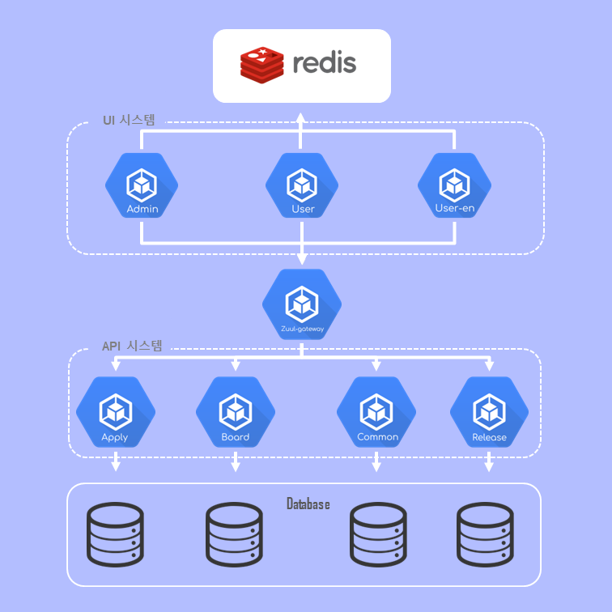

### [Index](https://github.com/K-PaaS/ap2cp-guide) > Architecture
## Table of Contents

1. [개요](#1)  
 1.1. [목적](#1.1)  
 1.2. [시스템 구성도](#1.2)  
 1.3. [프로젝트 소개](#1.3)  

# 
1.  문서 개요

## 
1.1. 목적
본 문서는 MSA구조 어플리케이션인 K-PaaS 대표포털 Architecture를 제공한다. AP에서 운영되고 있는 MSA 구조 어플리케이션을 컨테이너로 이미지 전환을 가이드한다.
 

## 
1.2. 시스템 구성도

<kbd>
  
</kbd>

## 
1.3. 프로젝트 소개
- kps-web-user, kps-web-user-en, kps-web-admin은 UI 역할을 담당하는 프론트단으로써 spring 프로젝트, JDK8 환경으로 개발 및 구성
- kps-api-apply, kps-api-board, kps-api-common, kps-api-release는 백단으로써 spring 프로젝트, JDK8 환경으로 개발 및 구성
- kps-zuul-gateway은 API 게이트웨이로써 spring boot 프로젝트, JDK8 환경으로 개발 및 구성
- kps-ui-redis는 캐시를 저장 및 관리 하는 Key, Value 구조의 비관계형 데이터 베이스 관리 시스템
- kps-mysql-apply, kps-mysql-board, kps-mysql-common, kps-mysql-release는 백단 api가 각각 관리하는 데이터베이스 

|API 명|프로젝트| API 역할| 포트   |Path|
|---|---|-------|------|---|
|kps-api-apply|spring|지원 관련 API| 9050 ||
|kps-api-board|spring|게시글 API| 9040 ||
|kps-api-common|spring|공통 처리 API| 9030 ||
|kps-api-release|spring|기업 정보 API| 9060 ||
|kps-web-user|spring|국문 포털 UI| 8080 |/|
|kps-web-user-en|spring|영어 포털 UI| 8070 |/eng|
|kps-web-admin|spring|관리자 포털 UI| 8090 |/kpsadmin|
|kps-zuul-gateway|spring boot|API Gateway| 9021 ||
|kps-ui-redis|redis|세션 저장소| 6379 ||
|kps-mysql-apply|mysql|지원 관련 DB| 3306 ||
|kps-mysql-board|mysql|게시글 DB| 3306 ||
|kps-mysql-common|mysql|공통처리 DB| 3306 ||
|kps-mysql-release|mysql|기업정보 DB| 3306 ||

 

### [Index](https://github.com/K-PaaS/ap2cp-guide) > Architecture
