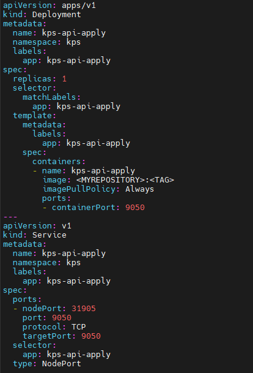
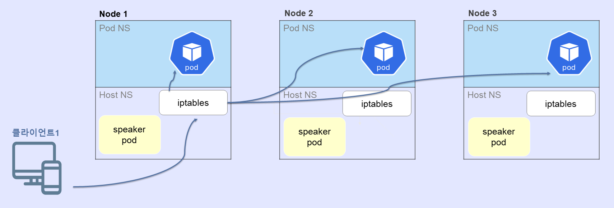
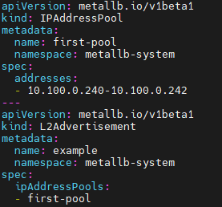
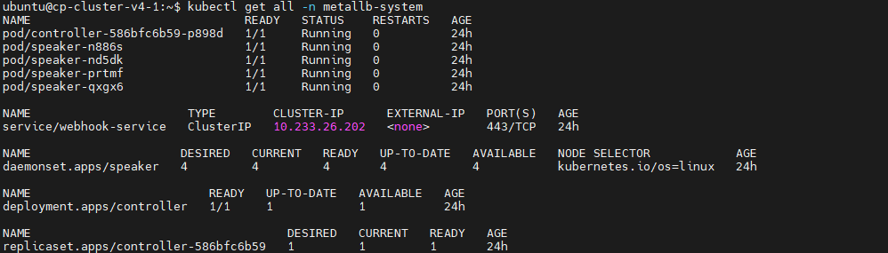
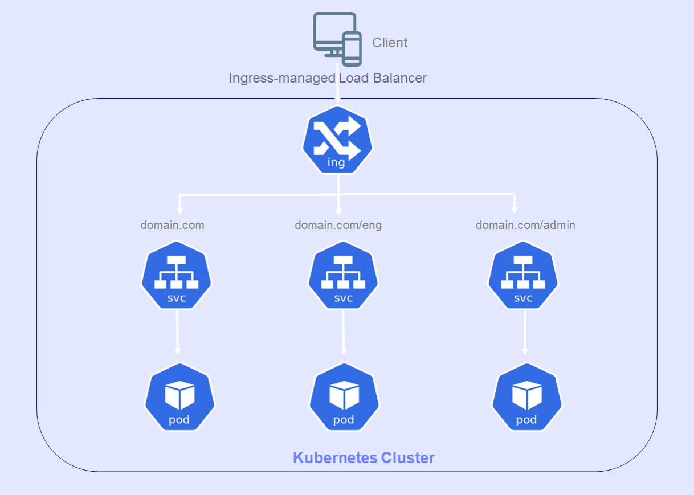
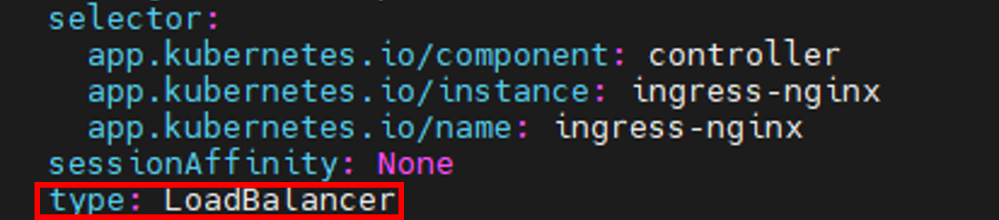
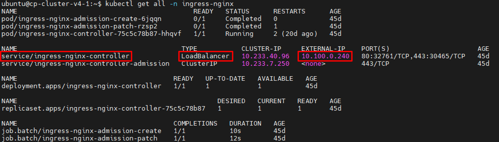
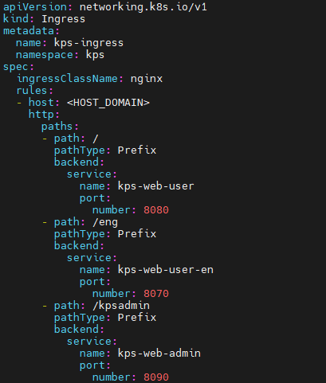
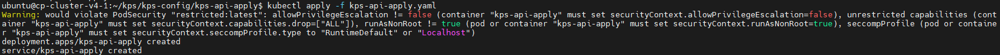
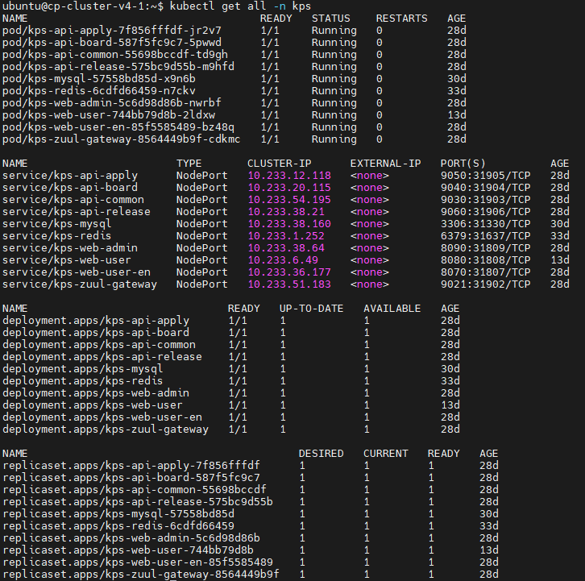

### [Index](https://github.com/K-PaaS/guide) > [ap2cp-guide](https://github.com/K-PaaS/ap2cp-guide) > Common

## Table of Contents

1. [개요](#1)  
 1.1. [목적](#1.1)    
 1.2. [소개](#1.2)  
 1.3. [참고 자료](#1.3)    
 1.4. [Prerequisite](#1.4)  
2. [Kubernetes 활용](#2)  
 2.1. [Kubernetes yaml 파일 작성](#2.1)  
 2.2. [http/s 액세스 설계](#2.2)  
　2.2.1. [MetalLB 소개](#2.2.1)    
　2.2.2. [MetalLB 설정 및 배포](#2.2.2)  
　2.2.3. [Ingress Controller 소개](#2.2.3)  
　2.2.4. [Ingress Controller 설정](#2.2.4)  
　2.2.5. [Ingress 작성](#2.2.5)  
 2.3. [Kubernetes 배포](#2.3)  
 2.4. [Kubernetes 조회](#2.4)  

# <div id='1'/>1. 문서 개요

## <div id='1.1'/>1.1. 목적
본 문서는 어플리케이션 플랫폼 종료에 따라 전환 가이드 제공 및 기술 지원하는 데 그 목적이 있다. [Container Rootfs](../running-app/container-rootfs/container-rootfs-guide.md), [Droplet](../running-app/droplet/droplet-guide.md), [Pack](../pack/pack-guide.md), [Docker file](../dockerfile/dockerfile-guide.md) 총 네가지 방법으로 생성한 이미지를 컨테이너 플랫폼(쿠버네티스) 환경에 배포하는 공통 가이드를 제공한다.

<br>

## <div id='1.2'/>1.2. 소개
- [Container Rootfs](../running-app/container-rootfs/container-rootfs-guide.md), [Droplet](../running-app/droplet/droplet-guide.md), [Pack](../pack/pack-guide.md), [Docker file](../dockerfile/dockerfile-guide.md) 방법으로 생성한 이미지를 가지고 쿠버네티스를 활용하여 배포하는 방법에 대해 소개한다.

## <div id='1.3'/>1.3. 참고 자료
- Container Platform Cluster Installation Guide: [https://github.com/K-PaaS/container-platform/blob/master/install-guide/standalone/cp-cluster-install.md](https://github.com/K-PaaS/container-platform/blob/master/install-guide/standalone/cp-cluster-install.md)
- Nginx Installation Document:
  [https://docs.nginx.com/nginx-ingress-controller/installation/installing-nic/installation-with-manifests/](https://docs.nginx.com/nginx-ingress-controller/installation/installing-nic/installation-with-manifests/)
- MetalLB Installation Document:
  [https://metallb.universe.tf/installation/](https://metallb.universe.tf/installation/)

## <div id='1.4'/>1.4. Prerequisite
- Container Platform Cluster 설치([1.3 참고 자료](#1.3))
- Nginx Controller 설치
    + Container Platform Cluster v1.4, v1.5 설치시 자동 설치, 직접 설치시([1.3 참고 자료](#1.3))
- MetalLB 설치
    + Container Platform Cluster v1.5 설치시 자동 설치, 직접 설치시([1.3 참고 자료](#1.3))
        <table>
          <tr>
            <td align="center">Version</td>
            <td align="center">Kubernetes</td>
            <td align="center">Ingress Controller</td>
            <td align="center">MetalLB</td>
          </tr>
          <tr>
            <td align="center">v1.5</td>
            <td align="center">O</td>
            <td align="center">O</td>
            <td align="center">O</td>
          </tr>
          <tr>
            <td align="center">v1.4</td>
            <td align="center">O</td>
            <td align="center">O</td>
            <td align="center">X</td>
          </tr>
          <tr>
            <td colspan="4" align="center">이하 버전 생략</td>
          </tr>
        </table>
   
      
<br><br>

# <div id='2'/>2. Kubernetes 활용
## <div id='2.1'/>2.1. Kubernetes yaml 파일 작성
- Kubernetes Yaml 파일을 작성하여 이미지를 배포한다.
- Kubernetes Deployment와 Service를 작성하여 배포한다. 
```
apiVersion: apps/v1
kind: Deployment
metadata:
  name: [DEPLOYMENT_NAME]                     #배포시 사용할 디플로이먼트 이름
  namespace: [NAMESPACE_NAME]                 #네임스페이스 이름
  labels: 
    [LABEL_KEY]: [LABEL_VALUE]               #사용할 라벨 지정(key, value)
spec:
  replicas: [REPLICAS]                        #레플리카 개수
  selector:
    matchLabels:
      [LABEL_KEY]: [LABEL_VALUE]            #사용할 라벨 지정(key, value)
  template:
    metadata:
      labels:
        [LABEL_KEY]: [LABEL_VALUE]           #사용할 라벨 지정(key, value)
    spec:
      containers:
      - name: [CONTAINER_NAME]                #Pod에 배포될 컨테이너 이름
        image: [IMAGE_REPOSITORY_URL]         #이미지 레파지토리 주소
        imagePullPolicy: Always
        env:
        - name: [ENV_NAME]                    #환경변수 이름
          value: [ENV_VALUE]                  #환경변수 value
        ports:
        - containerPort: [CONTAINER_PORT]     #컨테이너 포트 번호
---
apiVersion: v1
kind: Service
metadata:
  name: [SERVICE_NAME]                        #배포시 사용할 서비스 이름
  namespace: [NAMESPACE_NAME]                 #네임스페이스 이름
  labels:
    [LABEL_KEY]: [LABEL_VALUE]                #사용할 라벨 지정(key, value)
spec:
  ports:
  - nodePort: [NODE_PORT]                     #노드 포트 번호
    port: [PORT]                              #서비스 붙힐 컨테이너 포트번호
    protocol: TCP
    targetPort: [TARGET_PORT]                 #서비스 붙힐 컨테이너 포트번호
  selector:
    [LABEL_KEY]: [LABEL_VALUE]                #사용할 라벨 지정(key, value) 
  type: NodePort
```
<kbd>
  
</kbd>
<br>

## <div id='2.2'/>2.2. http/s 액세스 설계
### <div id='2.2.1'/>2.2.1. MetalLB 소개
- 클라우드 환경은 클라우드 플랫폼에서 자체 제공하는 로드밸런서를 사용하여 로드 밸런싱 기능을 사용할 수 있지만 클라우드 환경이 아닌 온프레미스 환경에서는 로드밸런싱 기능을 제공하는 모듈을 추가해줘야한다. MetalLB는 BareMetalLoadBalancer	 약자로 베어메탈 환경에서 로드 밸런서를 제공하는 오픈소스 프로젝트이다. MetalLB 기능은 표준프로토콜인 ARP(IPv4)/NDP(IPv6), BGP를 사용하여 External IP를 전파한다. 본 문서는 MetalLB에서 제공하는 L2모드를 사용하여 http/s 액세스 설계를 진행한다. L2모드는 각 노드마다 speaker 데몬셋이 생성되어 리더 speaker pod를 선출한 뒤 리더 speaker pod가 있는 노드로 모든 트래픽이 가게 된다. 리더 speaker pod는 External IP를 관리하게 되고 iptables 규칙에 따라서 분산되어 패킷이 pod로 전파하게 된다.
- [MetalLB L2모드 설명 참고](https://metallb.universe.tf/concepts/layer2/)

<kbd>
  
</kbd>
<br>

### <div id='2.2.2'/>2.2.2. MetalLB 설정 및 배포
- MetalLB 설치시 IPAddressPool에 네트워크 범위를 지정해서 배포해야한다.
- [MetalLB Advanced AddressPool 설정 참고](https://metallb.universe.tf/configuration/_advanced_ipaddresspool_configuration/)
```
apiVersion: metallb.io/v1beta1
kind: IPAddressPool
metadata:
  name: first-pool
  namespace: metallb-system
spec:
  addresses:
  - [METALLB_NETWORK]             #MetalLB 네트워크 대역 지정
---
apiVersion: metallb.io/v1beta1
kind: L2Advertisement             #MetalLB L2 모드
metadata:
  name: example
  namespace: metallb-system
spec:
  ipAddressPools:
  - first-pool                    #사용할 IPAddressPool 지정 
```

<kbd>
  
</kbd>
<br>

- MetalLB를 설치하고 조회하면 아래와 같이 배포가 된다.
```
$ kubectl get all -n metallb-system
```
<kbd>
  
</kbd>
<br>

### <div id='2.2.3'/>2.2.3. Ingress Controller 소개
- Ingress는 클러스터 외부에서 내부 서비스로 접근하는 Http/s 요청을 어떻게 처리할지 정의해둔 규칙이다. Ingress는 Ingress Controller에 의해 동작하며 Ingress Controller는 Http로드 밸런서를 구성하는 서버이다.
- [Ingress Controller 설명 참고](https://kubernetes.io/docs/concepts/services-networking/ingress-controllers/)

<kbd>
  
</kbd>
<br>


### <div id='2.2.4'/>2.2.4. Ingress Controller 설정
- ingress-nginx-controller 서비스 Type을 LoadBalancer로 수정을 하면 MetalLB에서 지정한 네트워크 대역 중 하나를 ingress-nginx-controller 서비스 EXTERNAL-IP로 할당이 된다.
- 사용하는 클라우드 플랫폼에서 Cluster 전체 Master와 Worker들의 인터페이스에 ingress-nginx-controller의 EXTERNAL-IP를 추가하여 ingress-nginx-controller로 각 노드에 접근 가능하게 한다.
- 사용하는 클라우드 플랫폼에서 Floating IP를 ingress-nginx-controller의 EXTERNAL-IP에 할당해주어 외부에서 접근 가능하게 한다.
- Host Domain을 구매하여 서비스하고 있는 Floating IP를 할당한다.
```
$ kubectl edit service ingress-nginx-contoller -n ingress-nginx
```
<kbd>
  
</kbd>
<br>

```
$ kubectl get all -n ingress-nginx
```

<kbd>
  
</kbd>
<br>

### <div id='2.2.5'/>2.2.5. Ingress 작성
- Kubernetes Ingress를 작성하여 Host Domain으로 접근 가능하게 배포를 한다.
```
apiVersion: networking.k8s.io/v1
kind: Ingress
metadata:
  name: [INGRESS_NAME]                     #배포시 사용할 인그레스 이름
  namespace: [NAMESPACE_NAME]              #네임스페이스 이름
spec:
  ingressClassName: nginx
  rules:
  - host: [HOST_DOMAIN]                     #호스트 도메인
    http:
      paths:
      - path: /                             #path 지정
        pathType: Prefix
        backend:
          service:        
            name: [SERVICE_NAME]            #접근 서비스 이름
            port:
              number: [CONTAINER_PORT]      #접근 서비스 컨테이너 번호
```
<kbd>
  
</kbd>
<br>

## <div id='2.3'/>2.3. Kubernetes 배포
- Kubernetes 배포시 작성해둔 yaml파일 위치에서 실행 또는 경로를 찾아 배포한다.
```
$ kubectl apply -f [YAML_FILE]
```
<kbd>
  
</kbd>
<br>

## <div id='2.4'/>2.4. Kubernetes 조회
- Kubernetes 리소스를 조회한다.
```
$ kubectl get all -n [NAMESPACE_NAME]
```
<kbd>
  
</kbd>
<br>

### [Index](https://github.com/K-PaaS/guide) > [ap2cp-guide](https://github.com/K-PaaS/ap2cp-guide)s > Common