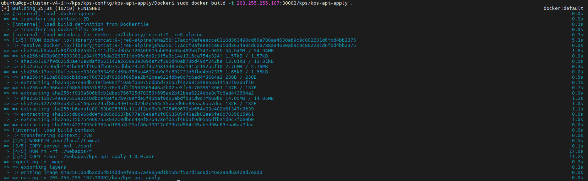
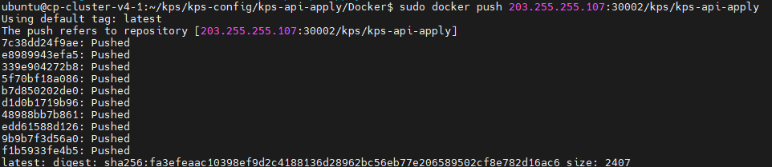

### [Index](https://github.com/K-PaaS/ap2cp-guide) > Pack

## Table of Contents

1. [개요](#1)  
 1.1. [목적](#1.1)  
 1.2. [소개](#1.2)  
 1.3. [참고 자료](#1.3)  
 1.4. [Prerequisite](#1.4)
2. [Docker 활용](#2)  
 2.1. [Dockerfile 생성](#2.1)  
　2.1.1. [Dockerfile 작성법](#2.1.1)    
　2.1.2. [Server.xml 설정](#2.1.2)  
 2.2. [이미지 빌드](#2.2)  
 2.3. [생성된 이미지 푸시](#2.3)  
3. [Kubernetes 설정 및 배포](#3)  
 3.1. [공통 가이드](#3.1)


# <div id='1'/>1. 문서 개요

## <div id='1.1'/>1.1. 목적
본 문서는 어플리케이션 플랫폼 종료에 따라 전환 가이드 제공 및 기술 지원하는 데 그 목적이 있다. Dockfile을 작성하여 이미지를 빌드하고 배포하는 과정에 대해 소개하며 모든 과정은 Linux 환경 기반으로 진행한다.
<br>

## <div id='1.2'/>1.2. 소개
도커파일을 사용해서 전통적인 방식으로 이미지를 빌드한다. 이후 생성된 이미지는 쿠버네티스를 통해 배포한다.

## <div id='1.3'/>1.3. 참고 자료
- Container Platform Cluster Installation Guide: [https://github.com/K-PaaS/container-platform/blob/master/install-guide/standalone/cp-cluster-install.md](https://github.com/K-PaaS/container-platform/blob/master/install-guide/standalone/cp-cluster-install.md)
- Docker Document: [https://docs.docker.com](https://docs.docker.com)
- Docker Installation Document: [https://docs.docker.com/engine/install/](https://docs.docker.com/engine/install/)

## <div id='1.4'/>1.4. Prerequisite
- Container Platform Cluster 설치([1.3 참고 자료](#1.3))
- Docker 설치([1.3 참고 자료](#1.3))
  
<br><br>

# <div id='2'/>2. Docker 활용
## <div id='2.1'/>2.1. Dockerfile 생성
### <div id='2.1.1'/>2.1.1. Dockerfile 작성법
- K-PaaS 대표포털은 아파치 톰캣 9.0 환경에서 동작하며 각 어플리케이션이 동작하는데 필요한 베이스 이미지를 넣어준다. 
- ENV명령어에 각 어플리케이션이 동작하는데 필요한 환경변수를 넣어준다.
```
FROM tomcat:9-jre8-alpine  # 사용할 베이스 이미지를 지정
WORKDIR /usr/local/tomcat  # 사용할 디렉토리 고정
COPY server.xml ./conf     # 고정해둔 디렉토리에 있는 server.xml을 복사
RUN rm -rf ./webapps/*     # 기본으로 있는 root를 삭제
ARG JAR_FILE=*.war         # 현재 디렉토리에 있는 war파일 변수 지정
COPY ${JAR_FILE} ./webapps/kps-api-apply-1.0.0.war   # 고정해둔 디렉토리에 war파일을 복사 
ENV JAVA_OPTS="-Djava.security.egd=file:///dev/urandom -Dspring.profiles.active=prd"  # 어플리케이션 실행에 필요한 자바 런타임 환경변수 추가

EXPOSE 9050                # 컨테이너 외부로 개방할 포트 번호
```

<br>

### <div id='2.1.2'/>2.1.2. Server.xml 설정
- server.xml은 톰캣이 실행시 필요한 정보를 정의한 파일이다. 각 어플리케이션이 실행하는데 필요한 설정에 맞게 값을 추가하거나 변경한다.
- 아래 예시는 kps-web-user-en 어플리케이션의 server.xml 설정값 일부다. 
```
# appBase와 docBase를 변경하지 않으면 webapps/root가 기본 경로가 된다.
...
<Host appBase="webapps" autoDeploy="true" name="localhost" unpackWARs="true">
<Context docBase="kps-web-user-en-1.0.0" path="/eng"  reloadable="true">
```

<br>

## <div id='2.2'/>2.2. 이미지 빌드
- Dockerfile 빌드시 압축파일(jar, war) 위치에서 실행 또는 경로를 찾아 빌드한다.
- MSA 구조에서는 이미지 빌드시 spring 프로젝트는 Dockerfile, war/jar파일, server.xml이 필요하다.
- MSA 구조에서는  이미지 빌드시 spring boot 프로젝트는 Dockerfile, war/jar파일, application.yaml이 필요하다.
```
$ docker build -t [IMAGE_NAME] [MY_REPOSITORY]:[TAG] .
```
<kbd>
  
</kbd>
<br>

## <div id='2.3'/>2.3. 생성된 이미지 푸시
- Docker 명령어를 통해 이미지 저장소에 pack으로 빌드한 이미지를 푸시해준다. 
```
$ docker push [MY_REPOSITORY]:[TAG]
```
<kbd>
  
</kbd>
<br>

# <div id='3'/>3. Kubernetes 설정 및 배포
## <div id='3.1'/>3.1. 공통 가이드
- #### [공통 가이드](../common/common-guide.md)

### [Index](https://github.com/K-PaaS/ap2cp-guide) > Pack