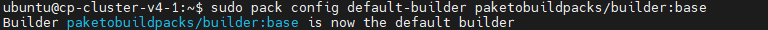

### [Index](https://github.com/K-PaaS/ap2cp-guide) > Pack

## Table of Contents

1. [개요](#1)  
 1.1. [목적](#1.1)  
 1.2. [소개](#1.2)  
 1.3. [참고 자료](#1.3)  
 1.4. [Prerequisite](#1.4)
2. [Paketo Buildpacks 활용](#2)  
 2.1. [환경구축](#2.1)   
 2.2. [Paketo Base Builder 설정](#2.2)  
 2.3. [Pack 빌드](#2.3)  
　2.3.1. [Front Application 빌드](#2.3.1)    
　2.3.2. [Back Application 빌드](#2.3.2)  
　2.3.3. [API Gateway Application 빌드](#2.3.3)  
3. [Docker 활용](#3)  
 3.1. [이미지 조회](#3.1)  
 3.2. [이미지 태그](#3.2)  
 3.3. [이미지 푸시](#3.3)  
4. [Kubernetes 설정 및 배포](#4)  
 4.1. [공통 가이드](#4.1)  

# <div id='1'/>1. 문서 개요
## <div id='1.1'/>1.1. 목적
본 문서는 어플리케이션 플랫폼 종료에 따라 전환 가이드 제공 및 기술 지원하는 데 그 목적이 있다. 어플리케이션 플랫폼을 Paketo Buildpacks을 활용하여 이미지를 빌드하고 배포하는 과정에 대해 소개하며 모든 과정은 Linux 환경 기반으로 진행한다.

<br>

## <div id='1.2'/>1.2. 소개
- buildpack은 두단계로 작동한다.
  + 감지단계 (The detect phase)
    > 빌드팩이 소스 코드를 분석하여 코드에 적합하다고 판단되는 빌드팩 그룹이 선택 되는 단계이며 이미지 생성에 필요한 계약을 반환하고 build phase 진행
  + 빌드단계 (The build phase)
    > build phase은 코드베이스를 변환하고 빌드 시간 및 런타임 환경을 제공, 필요한 종속성 다운로드, 필요한 경우 코드 컴파일 및 진입점과 시작 스크립트를 설정
- builders
  + 컨테이너 이미지를 빌드하는 데 필요한 구성요소
  + 코드를 분석하고 앱 빌드 및 실행을 위한 계획을 제공하는 실행 파일 세트(빌드팩)
  + 스택은 빌드 이미지와 실행 이미지라는 두 가지 이미지로 구성
    - 빌드 이미지는 빌드 환경(빌드팩이 실행되는 컨테이너화된 환경)을 제공 
    - 실행 이미지는 런타임 중에 애플리케이션 이미지에 대한 환경을 제공
  + Lifecycle은 빌드팩 실행을 관리하고 결과 아티팩트를 최종 이미지로 조합
  + 하나의 빌더가 다양한 애플리케이션을 자동으로 감지하고 빌드
- 다양한 JVM 제공
  + Paketo 빌드팩은 기본적으로 Liberica JVM을 사용, Liberica는 주요 OpenJDK 기여자가 지원하고 Spring에서 권장하는 HotSpot 기반 Java 런타임

<br>

## <div id='1.3'/>1.3. 참고 자료
- Container Platform Cluster Installation Guide: [https://github.com/K-PaaS/container-platform/blob/master/install-guide/standalone/cp-cluster-install.md](https://github.com/K-PaaS/container-platform/blob/master/install-guide/standalone/cp-cluster-install.md)
 - Paketo Buildpacks Document: [https://paketo.io](https://paketo.io)   
 - Paketo Buildpacks Java Build Document: [https://paketo.io/docs/howto/java](https://paketo.io/docs/howto/java)
 - Paketo Buildpacks Installation Document: [https://buildpacks.io/docs/tools/pack/](https://buildpacks.io/docs/tools/pack/)
 - Docker Document: [https://docs.docker.com](https://docs.docker.com)  
 - Docker Installation Document: [https://docs.docker.com/engine/install/](https://docs.docker.com/engine/install/)  
 - Java Installation Document: [https://docs.oracle.com/en/java/javase/12/install/overview-jdk-installation.html#GUID-8677A77F-231A-40F7-98B9-1FD0B48C346A](https://docs.oracle.com/en/java/javase/12/install/overview-jdk-installation.html#GUID-8677A77F-231A-40F7-98B9-1FD0B48C346A)

## <div id='1.4'/>1.4. Prerequisite
- Container Platform Cluster 설치([1.3 참고 자료](#1.3))
- Docker 설치([1.3 참고 자료](#1.3))
- Pack 설치 ([1.3 참고 자료](#1.3))
- Java 설치 ([1.3 참고 자료](#1.3))
  
<br><br>

# <div id='2'/>2. Paketo Buildpacks 활용

## <div id='2.1'/>2.1. 환경구축
- 환경구축으로 Docker, Java, Pack CLI를 설치한다.([1.4 Prerequisite](#1.3))
- pack 빌드시 압축 파일(War, Jar)이 필요하다.

## <div id='2.2'/>2.2. Paketo Base Builder 설정
- paketobuildpacks을 Base builder로 설정한다.
```
$ pack config default-builder paketobuildpacks/builder:base
Builder paketobuildpacks/builder:base is now the default builder
```
<kbd>
  
</kbd>
<br>

## <div id='2.3'/>2.3. Pack 빌드
- pack 빌드시 압축파일(jar, war) 위치에서 실행 또는 경로를 찾아 빌드한다.
- 빌드하고자 하는 App에 맞게 필요한 환경변수와 필요한 옵션 값을 추가하여 빌드해 준다.
- 참고: https://paketo.io/docs/ 
```
 $ pack build [IMAGE_NAME] --path [WAR/JAR_FILE] --env [ENVIRONMENT]
```
### <div id='2.3.1'/>2.3.1. Front Application 빌드
- 가이드에서 제공하는 어플리케이션 ksp-web-ui, ksp-web-user, ksp-web-user-en은 빌드 방식이 아래와 같이 동일하다.
<kbd>
  
</kbd>
<br>

### <div id='2.3.2'/>2.3.2. Back Application 빌드
- 가이드에서 제공하는 어플리케이션 ksp-api-apply, ksp-api-board, ksp-api-common, ksp-api-release는 빌드 방식이 아래와 같이 동일하다.
<kbd>
  
</kbd>
<br>

### <div id='2.3.3'/>2.3.3. API Gateway Application 빌드
```
$ pack build kps-zuul-gateway --path kps-zuul-gateway-1.0.0.war --env "BP_JVM_VERSION: 8" --env "BP_SPRING_CLOUD_BINDINGS_DISABLED: true" 
```
<kbd>
  
</kbd>
<br>


# <div id='3'/>3. Docker 활용
## <div id='3.1'/>3.1. 이미지 조회
- pack 빌드를 하게되면 Docker 이미지로 생성된다. Docker 이미지 조회 명령어를 통해 이미지가 잘 생성 되었는지 조회한다.
```
$ docker images
```
## <div id='3.2'/>3.2. 이미지 태그
- 생성된 이미지에 태그를 추가한다.
```
$ docker image tag [IMAGE_NAME] [MY_REPOSITORY]:[TAG]
```
<kbd>
  
</kbd>
<br>

## <div id='3.3'/>3.3. 이미지 푸시
- Docker 명령어를 통해 이미지 저장소에 pack으로 빌드한 이미지를 푸시한다.
```
$ docker push [MY_REPOSITORY]:[TAG]
```

# <div id='4'/>4. Kubernetes 설정 및 배포
## <div id='4.1'/>4.1. 공통 가이드
- #### [공통 가이드](../common/common-guide.md)
### [Index](https://github.com/K-PaaS/ap2cp-guide) > Pack

