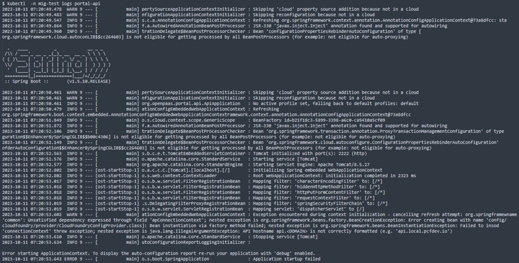

### [Index](https://github.com/K-PaaS/guide) > [ap2cp-guide](https://github.com/K-PaaS/ap2cp-guide) > Container Rootfs

## Table of Contents

1. [개요](#1)  
 1.1. [목적](#1.1)  
 1.2. [소개](#1.2)  
 1.3. [참고 자료](#1.3)  
 1.4. [Prerequisite](#1.4)  
2. [container rootfs 활용](#2)  
 2.1. [running 어플리케이션 확인 및 컨테이너 ID 확인](#2.1)  
 2.2. [컨테이너 동작 command 및  환경변수 확인](#2.2)  
 2.3. [diego-cell에서 컨테이너 확인 및 rootfs 경로 확인](#2.3)  
 2.4. [rootfs 디렉토리 tgz 생성 및 VM 밖에서 tgz 추출하기](#2.4)  
 2.5. [docker를 이용하여 이미지 생성 및 command 확인](#2.5)  
 2.6. [이미지 Repository 등록 및 Container Platform Cluster에 배포](#2.6)  
 2.7. [image 배포 로그 확인 ](#2.7)  
 2.8. [환경변수 적용 프로세스 정상화](#2.8)   
3. [Kubernetes 설정 및 배포](#3)  
 3.1. [공통 가이드](#3.1)


# <div id='1'/>1. 문서 개요
## <div id='1.1'/>1.1. 목적
본 문서는 어플리케이션 플랫폼 종료에 따라 전환 가이드 제공 및 기술 지원하는 데 그 목적이 있다. 어플리케이션 플랫폼을 container rootfs 활용하여 이미지를 추출하는 과정을 소개하며 모든 과정은 Linux 환경 기반으로 진행한다.

<br>

## <div id='1.2'/>1.2. 소개
AP에서 운영되고 있는 어플리케이션을 이미지로 전환하는 가이드이다. AP에 배포된 어플리케이션의 컨테이너 위치는 diego-cell 안의 garden에 위치하며 cf 및 bosh 명령어를 통해 이미지로 전환한다.

<kbd>
  
</kbd>

## <div id='1.3'/>1.3. 참고 자료
- Container Platform Cluster Installation Guide: [https://github.com/K-PaaS/container-platform/blob/master/install-guide/standalone/cp-cluster-install.md](https://github.com/K-PaaS/container-platform/blob/master/install-guide/standalone/cp-cluster-install.md)
- Cloud Foundry Installation Document: [https://docs.cloudfoundry.org/cf-cli/install-go-cli.html](https://docs.cloudfoundry.org/cf-cli/install-go-cli.html)
- Docker Installation Document: [https://docs.docker.com/engine/install/](https://docs.docker.com/engine/install/)


## <div id='1.4'/>1.4. Prerequisite
- Container Platform Cluster 설치([1.3 참고 자료](#1.3))
- Docker 설치([1.3 참고 자료](#1.3))
- CF 설치([1.3 참고 자료](#1.3))

<br><br>

# <div id='2'/>2. container rootfs 활용
## <div id='2.1'/>2.1. running 어플리케이션 확인 및 컨테이너 ID 확인
- AP기반으로 동작하는 어플리케이션을 확인한다.
```
# cf apps
```
<kbd>
  
</kbd>
<br>

- 어플리케이션에 ssh 접속을 하여 container ID를 확인한다.
```
# cf ssh [APP_NAME]
```
<kbd>
  
</kbd>
<br>

## <div id='2.2'/>2.2. 컨테이너 동작 command 및  환경변수 확인
```
$ ps -ef
```
<kbd>
  
</kbd>

<br>

- 컨테이너의 환경변수를 확인한다.
```
$ cf env [APP_NAME]
```
<kbd>
  
</kbd>

<br>

## <div id='2.3'/>2.3. diego-cell에서 컨테이너 확인 및 rootfs 경로 확인
- diego-cell에 ssh 접속 후  컨테이너를 확인한다.
```
$ bosh -d [DEPLOYMENT_NAME] ssh diego-cell

$ sudo su
# cd /var/vcap/
# /var/vcap/packages/containerd/bin/ctr  \
--address /var/vcap/sys/run/containerd/containerd.sock  \
-namespace garden container list
```
<kbd>
  
</kbd>

<br>
- container ID를 사용하여 rootfs 경로를 확인한다.

```
/var/vcap/packages/containerd/bin/ctr   \
--address "/var/vcap/sys/run/containerd/containerd.sock"  \
-namespace garden container info [CONTAINER_ID]  \
grep rootfs
```
<kbd>
  
</kbd>

<br>


## <div id='2.4'/>2.4. rootfs 디렉토리 tgz 생성 및 VM 밖에서 tgz 추출하기
- rootfs 디렉토리 위치로 이동한다.
```
$ cd /var/vcap/data/grootfs/store/unprivileged/images/[CONTAINER_ID]/rootfs
```
<kbd>
  
</kbd>

<br>

- rootfs 디렉토리를 tgz파일로 압축한다.

```
$ tar zcf /var/vcap/data/[CONTAINER_ID].tgz  *
```
<kbd>
  
</kbd>

<br>


## <div id='2.5'/>2.5. docker를 이용하여 이미지 생성 및 command 확인
- docker를 이용하여 이미지를 생성한다. 
```
$ docker image import [TGZ_NAME] [IMAGE_NAME]
```
<kbd>
  
</kbd>

<br>

- docker를 이용하여 이미지를 실행하여 이미지가 제대로 생성 되었는지 확인한다.
```
$ docker run [IMAGE_NAME]  \
   /home/vcap/app/.java-buildpack/open_jdk_jre/bin/java   \
   -cp /home/vcap/app/. org.springframework.boot.loader.JarLauncher
```
<kbd>
  
</kbd>

<br>


## <div id='2.6'/>2.6. 이미지 Repository 등록 및 Container Platform Cluster에 배포
- docker를 이용하여 생성한 이미지의 태그를 변경한다.
```
$ docker image tag [IMAGE_NAME] [MY_REPOSITORY]:[TAG]
```
- docker를 이용하여 태그를 변경한 이미지를 이미지 저장소에 업로드한다.
```
$ docker image push [MY_REPOSITORY]:[TAG]
```
<kbd>
  
</kbd>

<br>

- 쿠버네티스 kubectl을 이용하여 Namespace를 생성한다.
```
$ kubectl create namespace [NAMESPACE_NAME]
```
- 쿠버네티스 kubectl을 이용하여 Pod를 클러스터에 배포한다.
```
$ kubectl -n [NAMESPACE_NAME] apply -f - <<EOF
apiVersion: v1
kind: Pod
metadata:
  name: [POD_NAME]
spec:
  containers:
  - name: [CONTAINER_NAME]
    image: [MY_REPOSITORY]:[TAG] 
    command: ["sh","-c","[PROCESS_COMMAND]"]
EOF
```
<kbd>
  
</kbd>

<br>

## <div id='2.7'/>2.7. image 배포 로그 확인 
- 쿠버네티스 kubectl을 이용하여 배포한 pod의 로그를 확인한다.
```
$ kubectl -n [NAMESPACE_NAME] logs [POD_NAME]
```
<kbd>
  
</kbd>

<br>

## <div id='2.8'/>2.8. 환경변수 적용 프로세스 정상화
- cf 명령어를 사용하여 앱의 환경변수를 확인한다.
```
$ cf env [APP_NAME]
```
<kbd>
  
</kbd>

<br>

- 사용자 환경변수 복사후 [APP_NAME].env 테스트 파일을 생성한다. ( :  = )
```
$ vi [APP_NAME].env
```

<kbd>
  
</kbd>

# <div id='3'/>3. Kubernetes 설정 및 배포
## <div id='3.1'/>3.1. 공통 가이드
- #### [공통 가이드](../../common/common-guide.md)

### [Index](https://github.com/K-PaaS/guide) > [ap2cp-guide](https://github.com/K-PaaS/ap2cp-guide) > Container Rootfs

