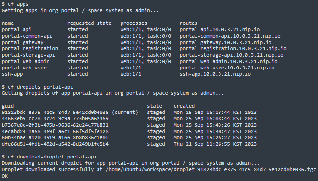
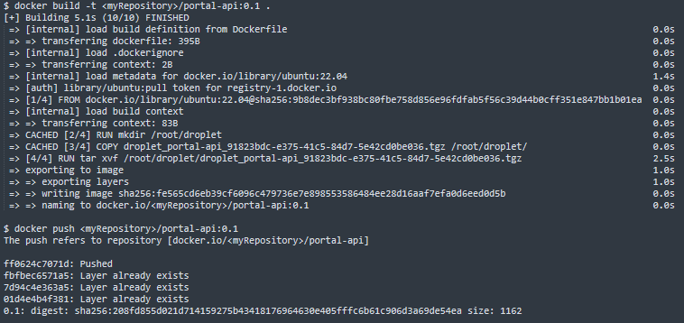
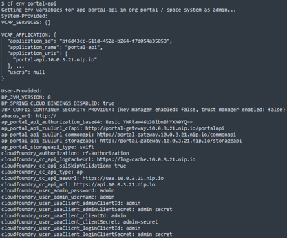
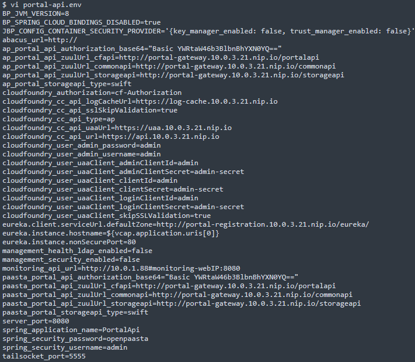
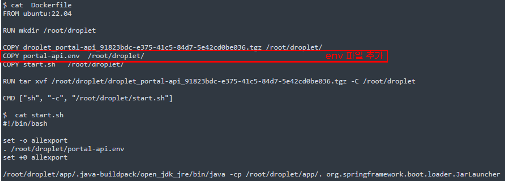

### [Index](https://github.com/K-PaaS/ap2cp-guide) > Droplet

## Table of Contents

1. [개요](#1)  
 1.1. [목적](#1.1)  
 1.2. [소개](#1.2)  
 1.3. [참고 자료](#1.3)  
 1.4. [Prerequisite](#1.4)
2. [droplet 파일 활용](#2)  
 2.1. [droplet 다운로드](#2.1)  
 2.2. [Dockerfile 작성, 이미지 build 및 Repository 등록](#2.2)  
 2.3. [환경변수 적용 프로세스 정상화](#2.3)  
 2.4. [Dockerfile 수정, 이미지 build 및 Repository 등록](#2.4)   
3. [Kubernetes 설정 및 배포](#3)  
  3.1. [공통 가이드](#3.1)

# <div id='1'/>1. 문서 개요

## <div id='1.1'/>1.1. 목적
본 문서는 어플리케이션 플랫폼 종료에 따라 전환 가이드 제공 및 기술 지원하는 데 그 목적이 있다. 어플리케이션 플랫폼을 droplet 활용하여 이미지를 추출하는 과정을 소개하며 모든 과정은 Linux 환경 기반으로 진행한다.
<br>

## <div id='1.2'/>1.2. 소개
AP에서 운영되고 있는 어플리케이션을 이미지로 전환하는 가이드이다. AP에 배포된 어플리케이션을 cf의 droplets 기능을 통해 이미지로 전환한다. droplets이란 application을 CFAR로 push하고 buildpack을 사용하여 deploy 하면 생성되는 CFAR의 실행 단위이다.

<br>

## <div id='1.3'/>1.3. 참고 자료
- Container Platform Cluster Installation Guide: [https://github.com/K-PaaS/container-platform/blob/master/install-guide/standalone/cp-cluster-install.md](https://github.com/K-PaaS/container-platform/blob/master/install-guide/standalone/cp-cluster-install.md)
- Cloud Foundry Document: [https://cli.cloudfoundry.org/ko-KR/v6/](https://cli.cloudfoundry.org/ko-KR/v6/)
- Cloud Foundry Droplet Document: [https://cli.cloudfoundry.org/ko-KR/v7/droplets.html](https://cli.cloudfoundry.org/ko-KR/v7/droplets.html)
- Cloud Foundry Installation Document: [https://docs.cloudfoundry.org/cf-cli/install-go-cli.html](https://docs.cloudfoundry.org/cf-cli/install-go-cli.html)
- Docker Installation Document: [https://docs.docker.com/engine/install/](https://docs.docker.com/engine/install/)

<br>

## <div id='1.4'/>1.4. Prerequisite
- Container Platform Cluster 설치([1.3 참고 자료](#1.3))
- Docker 설치([1.3 참고 자료](#1.3))
- CF 설치([1.3 참고 자료](#1.3))
<br><br>

# <div id='2'/>2. droplet 파일 활용
## <div id='2.1'/>2.1. droplet 다운로드
- AP기반으로 동작하는 어플리케이션을 확인한다.
```
# cf apps
```

- 어플리케이션의 droplet을 확인한다.
```
# cf droplets [APP_NAME]
```

- 어플리케이션의 droplet을 다운로드한다.
```
# cf download-droplet [APP_NAME]
```
<kbd>
  
</kbd>
<br>


## <div id='2.2'/>2.2. Dockerfile 작성, 이미지 build 및 Repository 등록
- Dockerfile을 작성한다.
```
$ vi Dockerfile

FROM ubuntu:22.04

RUN mkdir /root/droplet
COPY [DOWONLOADED_DROPLET_FILE] /root/droplet/
RUN tar xvf /root/droplet/[DOWONLOADED_DROPLET_FILE] -C /root/droplet/

CMD ["sh", "-c", "/root/droplet/app/.java-buildpack/open_jdk_jre/bin/java -cp /root/droplet/app/. org.springframework.boot.loader.JarLauncher"]
```
- docker를 이용하여 생성한 이미지를 생성한다.
```
$ docker build -t [IMAGE_NAME] [MY_REPOSITORY]:[TAG] .
```
- docker를 이용하여 생성한 이미지를 이미지 저장소에 업로드한다.
```
$ docker push [MY_REPOSITORY]:[TAG]
```
<kbd>
  
</kbd>
<br>


## <div id='2.3'/>2.3. 환경변수 적용 프로세스 정상화
- cf 명령어를 사용하여 앱의 환경변수를 확인한다.
```
$ cf env [APP_NAME]
```
<kbd>
  
</kbd>

<br>

- 사용자 환경변수 복사후 [APP_NAME].env 테스트 파일을 생성한다. ( :  = )
```
$ vi [APP_NAME].env
```

<kbd>
  
</kbd>

<br>


## <div id='2.4'/>2.4. Dockerfile 수정, 이미지 build 및 Repository 등록
- 앱의 환경변수 파일을 Dockerfile에 추가한다.
```
$ vi Dockerfile

FROM ubuntu:22.04

RUN mkdir /root/droplet
COPY [DOWONLOADED_DROPLET_FILE] /root/droplet/
COPY [APP_NAME].env /root/droplet/
COPY start.sh /root/droplet/

RUN tar xvf /root/droplet/[DOWONLOADED_DROPLET_FILE] -C /root/droplet/

CMD ["sh", "-c", "/root/droplet/start.sh"]
```
```
$ vi start.sh

#!/bin/bash

set -o allexport
. /root/droplet/[APP_NAME].env
set +0 allexport
/root/droplet/app/.java-buildpack/open_jdk_jre/bin/java -cp /root/droplet/app/. org.springframework.boot.loader.JarLauncher
```
<kbd>
  
</kbd>

<br>

- 이미지 재빌드 및 업로드
```
$ docker build -t [IMAGE_NAME] [MY_REPOSITORY]:[TAG] .
```
```
$ docker push [MY_REPOSITORY]:[TAG]
```

# <div id='3'/>3. Kubernetes 설정 및 배포
## <div id='3.1'/>3.1. 공통 가이드
- #### [공통 가이드](../../common/common-guide.md)

### [Index](https://github.com/K-PaaS/ap2cp-guide) > Droplet